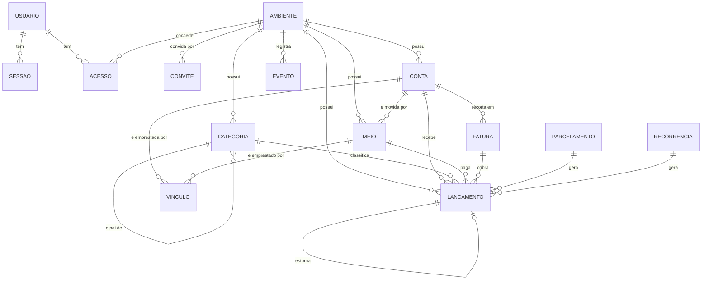

# Modelo de dados

O banco não é depósito do que o código decidiu: ele é a **segunda camada** do `ADR-0002` e a
única que continua valendo quando alguém abre um `psql`. Tudo abaixo segue disso.

**Três coisas o banco garante, e o código não pode:** que nenhuma consulta atravessa ambiente,
que valor monetário não tem fração binária, e que uma linha inválida não existe nem por
acidente.

## As entidades

`VINCULO` é o compartilhamento do `ADR-0004`: ele empresta **o uso** de uma conta ou de um
cartão a outro ambiente, e nunca a posse.

## Três famílias de tabela, três proteções

A pergunta *"como esta tabela é protegida?"* tem exatamente três respostas, e toda tabela nova
cai numa delas. **Não há quarta.**

| Família | Tabelas | Como é protegida |
|---|---|---|
| **Do ambiente** | `conta`, `categoria`, `meio`, `lancamento`, `fatura`, `parcelamento`, `recorrencia`, `evento` | Coluna `ambiente_id` **obrigatória** + política de RLS. É o caso normal |
| **Do usuário** | `usuario`, `sessao`, `convite` | Não têm `ambiente_id`. A proteção é a sessão: a consulta é sempre pelo usuário autenticado |
| **De ligação** | `ambiente`, `acesso`, `vinculo` | São as tabelas que **definem** quem vê o quê. A política delas é por acesso do usuário, não por `ambiente_id` |

**Dado financeiro sem `ambiente_id` é proibido** (`ADR-0002`). Se uma tabela nova parece não
precisar, a pergunta certa é em qual das três famílias ela está — e não "posso abrir exceção".

## Chaves

**`bigint` gerado pelo banco (`GENERATED ALWAYS AS IDENTITY`).** Sequencial, compacto e barato
de indexar.

Não é UUID, e a razão já estava escrita: o `04-api/convencoes.md` expõe o identificador como
número e diz que **ele não é segredo** — o que protege é o `ADR-0002`, não a dificuldade de
adivinhar. UUID resolveria fundir bancos ou gerar id fora do banco, e o sistema não faz nem um
nem outro.

**Chave natural onde ela existe**, como restrição única e não como chave primária: `usuario.email`
é único no sistema inteiro (é o identificador de login).

## Valor, data e instante

| O que | Coluna | Por quê |
|---|---|---|
| **Dinheiro** | `bigint`, em **centavos** | Regra 5. Nunca `numeric` com casas, nunca `double`. O centavo do arredondamento de parcela é decisão do domínio, e só funciona em inteiro |
| **Data de domínio** | `date` | `dataEvento`, `dataEfeito`, vencimento e fechamento. **Sem hora e sem fuso** — `timestamptz` aqui reintroduz o bug que a regra 5 tirou |
| **Instante** | `timestamptz`, gravado em **UTC** | Carimbo de auditoria e `evento.instante`. É o único lugar com hora |
| **Dia do evento** | `date` | `evento.dia` é dia de domínio; `evento.instante` é o carimbo. **São duas colunas, de propósito** |

## Enum é `varchar` com `CHECK`, não tipo do Postgres

`situacao`, `sentido`, `tipo` de conta, `status` de fatura, `origem` de evento: todos `varchar`
com restrição `CHECK`, guardando o valor que o domínio usa (`PROVISIONADO`, `CARTAO`, `SAIDA`).

O tipo `enum` nativo é mais compacto e **caro de evoluir**: acrescentar valor é `ALTER TYPE`, e
tirar um é quase impossível. Este projeto **já mudou um enum no meio do desenho** — `situacao`
tinha dois valores e ganhou `PROVISIONADO` (`ADR-0006`) —, e não há razão para achar que foi a
última vez. Com `CHECK`, evoluir é uma migration que troca a restrição.

## Lançamento é **uma** tabela

Gasto, receita, transferência, aporte, resgate, rendimento, pagamento de fatura, par de
rolagem, estorno e lançamento de abertura vivem na **mesma tabela**. Não há herança, não há
tabela por tipo, e não há coluna `tipo`.

É consequência direta do domínio: *saldo é a soma dos lançamentos da conta*, sem exceção
nenhuma. Uma tabela por tipo obrigaria toda consulta de saldo a unir dez tabelas — e a primeira
que alguém esquecesse de unir daria um saldo errado, calado.

O que diferencia um do outro são **campos opcionais que se excluem**: `transferenciaId`,
`pagamentoDeFatura`, `rolagemDeFatura`, `estornoDe`, `parcelamento`, `recorrencia`. Cada um é
uma coluna anulável com a sua restrição, e `parcelamento` e `recorrencia` **nunca aparecem
juntos**.

## O que nunca é coluna

Nada derivado é armazenado. Uma coluna a mais aqui é uma fonte de verdade a mais para divergir
da primeira, e num app de dinheiro ela diverge em silêncio.

| Não existe | Porque é derivado de |
|---|---|
| `conta.saldo` | Soma dos lançamentos da conta |
| `fatura.total`, `fatura.pago`, `fatura.a_pagar` | Lançamentos que apontam para ela |
| `conta.divida`, `limite_disponivel` | O saldo da conta `CARTAO` |
| `patrimonio` | Soma do saldo realizado das contas |
| `categoria.escolhivel` | `inativa` dela, `inativa` da raiz e existência de filho ativo |
| `lancamento.pendente` | `categoria IS NULL` |
| `fatura.encerrada` | `a pagar` maior que zero, ou não |

**Soft delete genérico não existe.** O domínio tem `inativa` na categoria e na conta, que é
outra coisa: é estado que o usuário escolhe e que a tela mostra, não uma linha escondida. E
exclusão física só acontece onde o domínio permite — quem nunca teve lançamento.

## O padrão de RLS

O `ADR-0002` decidiu; aqui está a forma:

1. A transação faz `SET LOCAL` de **duas** variáveis, postas pelo filtro que já validou o
   acesso (`docs/01-arquitetura/seguranca.md`): `app.usuario_id` e `app.ambiente_id`. São duas
   porque as famílias são duas: a tabela **do ambiente** pergunta *qual ambiente*, e a **de
   ligação** pergunta *qual usuário* — `acesso` não tem um ambiente corrente para comparar,
   ela é quem o autoriza.
2. Quem lê as variáveis são duas funções, `app_usuario_id()` e `app_ambiente_id()`, e as duas
   devolvem **`NULL` quando a variável não foi posta**, em vez de estourar. Sem contexto, toda
   comparação é falsa e **nada é visível** — é o lado certo para errar.
3. Toda tabela **do ambiente** tem política lendo `app_ambiente_id()`.
4. A política já nasce com o **`OR` do `ADR-0004`**: a linha é visível se o `ambiente_id` bate
   **ou** se existe `vinculo` que empreste aquela conta ou aquele meio ao ambiente ativo —
   **mesmo com a tabela `vinculo` vazia**. Escrever o `OR` depois é migration em cima de dado
   real; escrever agora custa uma linha.

**As tabelas de ligação também levam RLS**, com política por acesso do usuário — a forma exata
de cada uma está no `catalogo-tabelas.md`. As **do usuário** (`usuario`, `sessao`) não levam, e
não é omissão: o login procura o usuário pelo e-mail e a sessão é achada pelo cookie **antes de
existir contexto**. A proteção delas é a sessão, como esta página já dizia.

**`INSERT ... RETURNING` aplica a política de `SELECT` à linha inserida.** Vale lembrar porque
o driver do Postgres usa `RETURNING` para devolver a chave gerada: uma linha que a política não
enxerga **não pode ser inserida por quem precisa do id de volta**. Onde isso aperta — o
ambiente, que nasce antes do acesso que o torna visível — a saída está escrita no
`catalogo-tabelas.md`.

**A armadilha que faz RLS não valer nada:** o Postgres **não aplica política ao dono da
tabela** nem a quem tem `BYPASSRLS`. Por isso:

- A aplicação conecta com um **papel que não é dono das tabelas** e não tem `BYPASSRLS`.
- Toda tabela do ambiente leva `FORCE ROW LEVEL SECURITY` além de `ENABLE`.
- Migration roda com o papel dono; a aplicação, nunca.

Sem esses três, o RLS existe, o `psql` mostra a política, e **ela não filtra nada**.

## Índices que o domínio força

Não é lista completa (essa é do `catalogo-tabelas.md`) — são os que existem por causa de uma
regra, e que faltando quebram desempenho de um jeito difícil de rastrear:

| Índice | Regra que o exige |
|---|---|
| `lancamento (ambiente_id, conta_id, data_evento, id)` | Saldo é sempre soma dos lançamentos, e o cursor do Extrato ordena por `(dataEvento, id)` |
| `lancamento (fatura_id)` | Os três números da fatura são derivados a cada leitura |
| `lancamento (ambiente_id) WHERE categoria_id IS NULL` | A fila de pendências é exatamente essa consulta |
| `fatura (conta_id, status)` | "A `ABERTA` desta conta" é a pergunta mais frequente do ciclo |
| `evento (ambiente_id, dia)` | O Diário é um dia por vez |
| `sessao (expira_em)` | A limpeza das expiradas |

## Invariantes

- Toda tabela de dado financeiro tem `ambiente_id` **`NOT NULL`**, política de RLS **e**
  `FORCE ROW LEVEL SECURITY`.
- A aplicação nunca conecta como dono das tabelas nem com `BYPASSRLS`.
- A política de RLS traz o `OR` do vínculo desde a primeira migration.
- Nenhuma coluna guarda valor derivado — saldo, total de fatura, dívida ou patrimônio.
- Dinheiro é `bigint` em centavos; data de domínio é `date`; instante é `timestamptz` em UTC.
- Todo enum é `varchar` com `CHECK`, com o valor que o domínio usa.
- Lançamento é uma tabela só, sem coluna `tipo`; `parcelamento` e `recorrencia` nunca são
  preenchidos juntos.
- `categoria.pai` é imutável depois de criada (**não existe mover**), e a árvore tem no máximo
  dois níveis.
- `usuario.email` é único no sistema inteiro.

## Fronteiras com outros docs

| Pergunta | Doc dono |
|---|---|
| Colunas, tipos, constraints e índices de cada tabela | `03-dados/catalogo-tabelas` |
| Ferramenta, numeração e regras de alteração | `03-dados/migrations` |
| Por que o isolamento tem duas camadas | `ADR-0002` |
| O que o vínculo empresta, e o que não | `ADR-0004`, `02-dominio/compartilhamento` |
| Quem põe o ambiente no contexto | `01-arquitetura/seguranca` |
| O significado de cada campo | o doc do agregado em `02-dominio/` |
